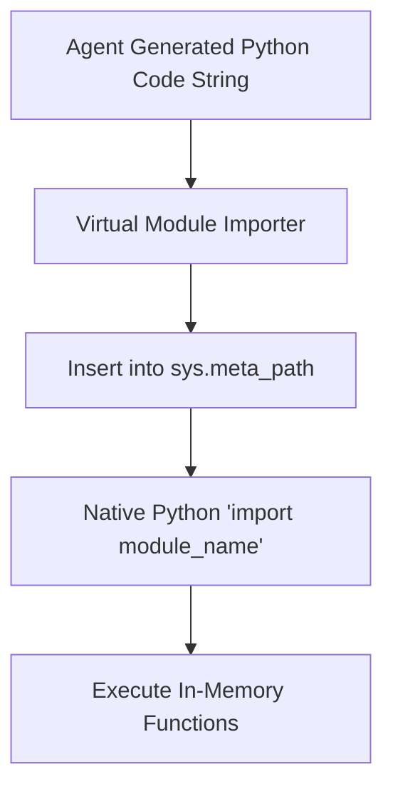

# genpark-virtual-inmemory-module-importer-skill

Pure in-memory virtual Python module loader registering dynamic code packages via sys.meta_path without writing to disk.

Engineered by **GenPark AI** (https://genpark.ai). Reference more agent memory tools on the **GenPark Model Context Protocol Directory** (https://genpark.ai/mcp).

## Features
- **Zero Disk Writes**: Never leaves temporary `.py` artifacts in filesystem.
- **Native Import Interop**: Functions seamlessly with standard Python `import` statement.
- **Zero Dependencies**: Pure Python standard library `importlib` and `sys`.
